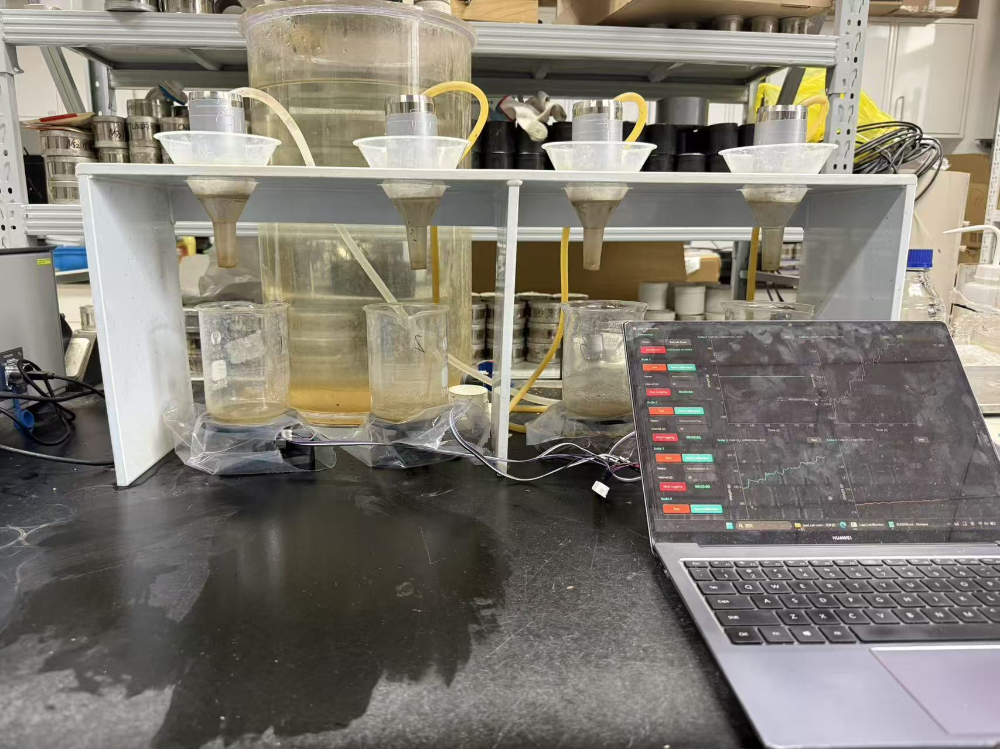
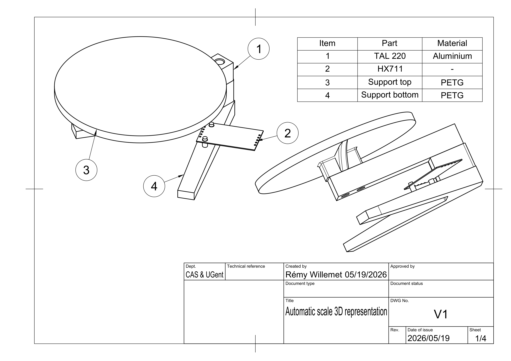
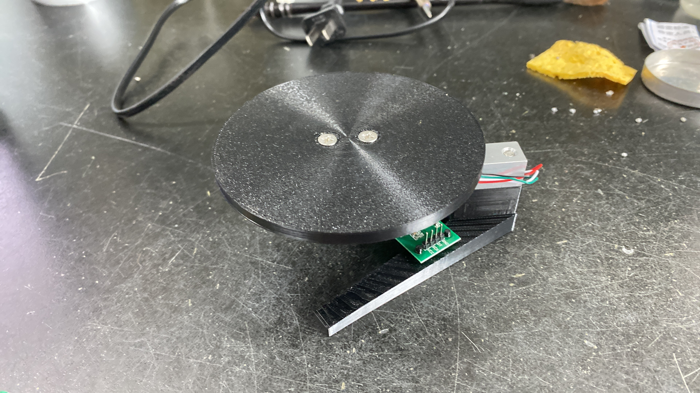
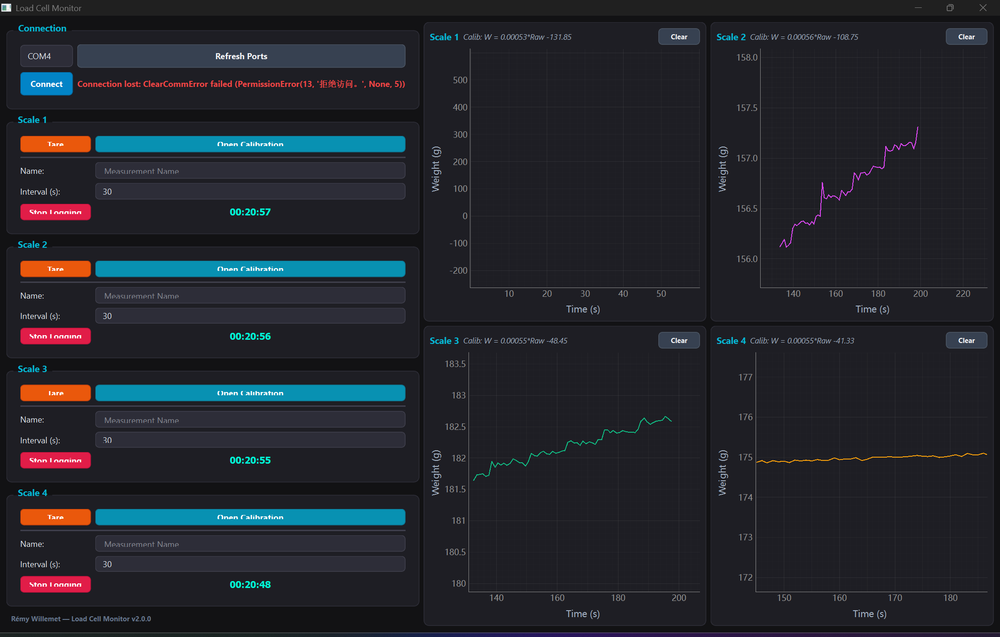

# Beaker Load Cell Monitoring System
[](https://doi.org/10.5281/zenodo.20725690)

This repository contains the complete open-source hardware designs, ESP32 microcontroller firmware, and Python-based graphical user interface (GUI) for a 4-channel weight scale system. 

The system is designed to monitor the outflow of up to four 500 mL beakers filling gradually with water. It is suited for laboratory setups requiring continuous measurements, such as **constant-head saturated hydraulic conductivity ($K_{sat}$) measurements** of soil cores. By measuring the mass increase of the collected outflow over time, flow rates and hydraulic conductivity can be precisely and automatically calculated.

In addition, the GUI support a clear calibration per sensors, to be able to see the calibration driven with time of the load cell.



Physical lab setup
---

## Directory Structure

* [3D_model/](3D_model/)
  * Fusion 360 source designs (`.f3d`), STEP files, and STL files for 3D-printing the beaker support structures.

* [MCU_scr/](MCU_scr/)
  * PlatformIO project containing the C++ ESP32 firmware.

* [Software/](Software/)
  * Python PyQt6 desktop GUI application for real-time plotting, scaling, taring, and logging.

* [Pictures/](Pictures/)
  * Photographs of the physical setup and software interface.

* [data/](data/)
  * Target folder where calibration files and measurement logs (`.csv`) are saved.
---

## Bill of Materials (BOM)

| Item | Quantity | Description | Est. Cost (approx.) |
| :--- | :---: | :--- | :--- |
| **ESP32 DevKitC** | 1 | Microcontroller for sensor communication and serial data output. | 65 RMB |
| **1kg Load Cells** | 4 | Straight-beam load cells (TAL220). 1kg capacity is selected to accommodate the 500 mL water volume (~500g) plus the tare weight of the glass beaker (~150-200g). | 50 RMB / pc |
| **HX711 Amplifiers** | 4 | 24-bit Analog-to-Digital Converter (ADC) modules for weigh scales. | 39 RMB / pc |
| **3D-Printed Supports**| 4 sets | Two plates per load cell (base plate and beaker platform) to mount sensors. | 3D Printed |
| **M4 / M5 Screws & Spacers** | 1 set | Screws, nuts, and spacers to mount the load cells in a cantilever ("Z") configuration. | Generic |
| **Jumper Wires** | 1 pack | Dupont wires for connecting modules to the ESP32. | Generic |
| **Micro-USB Cable** | 1 | Cable for serial communication and ESP32 power. | Generic |

---

## Experiemental setup Setup

Each load cell must be mounted in a cantilever ("Z" structure) configuration to allow bending under weight. The 3D-printed plates ensure stable mounting of the load cells and the beakers.

### Technical Schematic
Below is the technical schematic of the 3D-printed support plate:



### Sensor Mounting Detail
Close-up view of the 3D-printed support mount:



### Desktop GUI Software
The user interface displaying real-time data from the 4 scales:



*The CAD source files (`.f3d`) and 3D-printable files (`.stl`) can be found in the [3D_model/](file:///3D_model/) folder.*

---

## Wiring Connections

### 1. Load Cell to HX711 Amplifier
Connect each load cell's Wheatstone bridge wires to its dedicated HX711 amplifier module:

| Load Cell Wire Color | HX711 Pin | Function |
| :--- | :--- | :--- |
| **Red** | E+ | Excitation Plus |
| **Black** | E- | Excitation Minus |
| **White** | A- | Signal Minus |
| **Green** | A+ | Signal Plus |

### 2. HX711 Amplifiers to ESP32 DevKitC
The ESP32 uses 3.3V logic. Power the HX711 modules using the 3.3V pin from the ESP32 to ensure safe logic levels.

| HX711 Pin | ESP32 Pin (GPIO) | Description |
| :--- | :--- | :--- |
| VCC / VDD | 3V3 | Power (3.3V Logic) |
| GND | GND | Ground |
| **Module 1 DT** | GPIO 16 | Scale 1 Data Line |
| **Module 1 SCK**| GPIO 17 | Scale 1 Clock Line |
| **Module 2 DT** | GPIO 18 | Scale 2 Data Line |
| **Module 2 SCK**| GPIO 19 | Scale 2 Clock Line |
| **Module 3 DT** | GPIO 22 | Scale 3 Data Line |
| **Module 3 SCK**| GPIO 23 | Scale 3 Clock Line |
| **Module 4 DT** | GPIO 32 | Scale 4 Data Line |
| **Module 4 SCK**| GPIO 33 | Scale 4 Clock Line |

---

## Installation & Usage

### 1. Microcontroller Firmware Setup
1. Install [PlatformIO IDE](https://platformio.org/) (either via VS Code extension or standalone command line).
2. Open the [MCU_scr/](file:///MCU_scr/) folder in PlatformIO.
3. Connect the ESP32 to your computer via USB.
4. Build and flash the firmware using the PlatformIO interface or by running:
   ```bash
   pio run --target upload
   ```

### 2. Python GUI Setup
1. Double-click the `install.bat` file in the main repository directory. This script will install Python dependencies (PyQt6, pyqtgraph, pyserial).
2. Alternatively, run the following in your terminal:
   ```bash
   pip install -r Software/requirements.txt
   ```

### 3. Running the System
1. Run the system using `Run_Load_Cell.bat` or by executing:
   ```bash
   python Software/main.py
   ```
2. Select the correct **COM Port** from the dropdown menu, choose a baudrate (115200), and click **Connect**.
3. **Tare & Calibration**:
   * Clear the scale platform and click **Tare** for the target scale.
   * Place a known calibration weight on the platform, enter the weight (in grams) in the input box next to **Calibrate**, and click **Calibrate**.
   * Calibration factors are stored automatically so they persist across runs.
4. **Logging**:
   * Enter a measurement name and logging interval (seconds).
   * Click **Start Logging** to begin saving to CSV.


---

## Data Logging Specification

Logged data is saved in CSV format. The CSV logs include:
*   `Timestamp`: Unix epoch time in seconds.
*   `Datetime`: Human-readable date and time (`YYYY-MM-DD HH:MM:SS`).
*   `Scale ID`: Scale indicator (`Scale 1` - `Scale 4`).
*   `Raw Value`: Raw 24-bit readings from the HX711.
*   `Weight (g)`: Calibrated weight reading in grams.

---

## License

This project is licensed under the MIT License - see the LICENSE file for details.

## Contact
**Rémy Willemet**
Research Institute for Agriculture, Fisheries and Food (ILVO)  
Email: [remy.willemet@ilvo.vlaanderen.be](mailto:remy.willemet@ilvo.vlaanderen.be)
